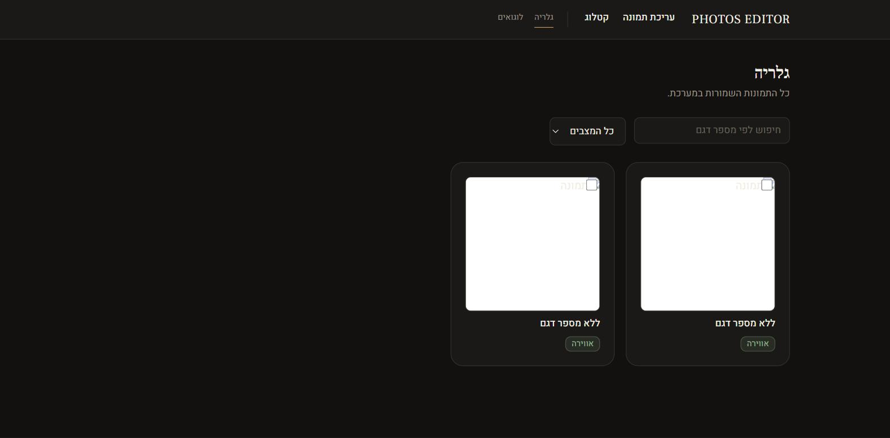

# PHOTOS EDITOR — shoe photo cleaner & catalog builder

A Next.js app for cleaning up shoe product photos (background removal, or full AI-generated "atmosphere" scenes), tagging them with product details (model number, SKU, sizes, color), and generating branded PDF catalogs — all in Hebrew/RTL.




- Background removal & scene generation via [Photoroom](https://www.photoroom.com/api)
- Storage & database via [Supabase](https://supabase.com)
- PDF catalogs via `@react-pdf/renderer`, rendered in an isolated worker process
- Dark "studio" design system with [`motion`](https://motion.dev) for animations

## Prerequisites

- Node.js 20+
- A [Supabase](https://supabase.com) project (Postgres + Storage)
- A [Photoroom](https://www.photoroom.com/api) API key

## Setup

1. **Install dependencies**

   ```bash
   npm install
   ```

2. **Environment variables** — create `.env.local` in the project root with:

   ```
   NEXT_PUBLIC_SUPABASE_URL=
   NEXT_PUBLIC_SUPABASE_ANON_KEY=
   SUPABASE_URL=
   SUPABASE_SERVICE_ROLE_KEY=
   POSTGRES_URL_NON_POOLING=
   PHOTOROOM_API_KEY=
   ```

   If the Supabase project is provisioned through the Vercel Marketplace integration, these (plus a few extra Postgres connection strings) can be pulled directly with `vercel env pull .env.local`. Otherwise, get the Supabase values from **Project Settings → API** and **Project Settings → Database** in the Supabase dashboard, and the Photoroom key from the Photoroom dashboard.

3. **Database schema** — apply the base schema and migrations in order (run from the `scripts/` directory context, or reference the path as shown):

   ```bash
   node scripts/migrate.mjs ../supabase/migration.sql
   node scripts/migrate.mjs ../supabase/migrations/0002_atmosphere_and_catalogs.sql
   node scripts/migrate.mjs ../supabase/migrations/0003_sku_color_burn_text.sql
   ```

   Any new migration added under `supabase/migrations/` should be applied the same way, once, against the shared database (the same DB is used across dev/preview/production).

4. **Storage buckets** — create the required Supabase Storage buckets (`originals`, `clean-images`, `logos`):

   ```bash
   node scripts/create-buckets.mjs
   ```

## Development

```bash
npm run dev
```

Opens on [http://localhost:3000](http://localhost:3000) (or the next available port). This also runs `build:pdf-worker`, which pre-bundles the PDF render worker — re-run automatically on every `dev`/`build` invocation, so no manual step is needed after editing anything under `src/lib/pdf/`.

## Build & deploy

```bash
npm run build
npm start
```

Deployed on [Vercel](https://vercel.com):

```bash
vercel deploy --prod
```

Environment variables must be configured in the Vercel project (or provisioned automatically via the Supabase Marketplace integration) for preview/production deployments.

## Project structure

- `src/app/` — routes (App Router): landing page, `/start` hub, `/create` (studio/atmosphere editing), `/photos` (gallery), `/logos`, `/catalog` (PDF catalog builder)
- `src/components/` — shared UI (`ui/`), motion primitives (`motion/`), and feature components
- `src/lib/` — Photoroom client, image compositing (`sharp`), PDF generation
- `supabase/` — SQL schema and migrations
- `scripts/` — one-off Node scripts (migrations, bucket setup, PDF worker bundling)
